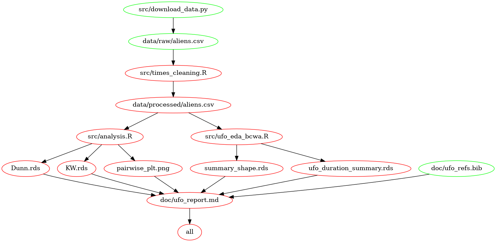

# UFO Sighting

  - author: Group-20 DSCI-522
  - contributors: Jacob McFarlane, Chirag Rank, Steffen Pentelow, Anita
    Li

## About

Unidentified flying objects (UFOs) have different shapes and could
potentially be linked with the duration of sightings. In this analysis
we use Kruskal-Wallis test to answer whether the duration of sightings
of UFOs of different shapes are significantly different. The result
indicates that there are differences in duration among these shapes.
Then, we selected the Dunn test for Post-Hoc analysis with Bonferroni’s
correction to identify pairs of groups whose median duration are
significantly different.

We have selected the National UFO Reporting Center (NUFORC) maintained
database of sightings of unidentified flying objects (UFO). We will deal
specifically with reports made in British Columbia, Canada and
Washington State, USA before 11/18/2020. While NURFORC does curate
reports and remove obvious hoaxes, the data is submitted by users and in
the majority of cases presented in the users’ own words. The data set
for BC can be found [here](http://www.nuforc.org/webreports/ndxlBC.html)
and the data set for Washington can be found
[here](http://www.nuforc.org/webreports/ndxlWA.html). Each row contains
information on a single reported UFO sighting. Our analysis focuses on
the `shape` and `duration` columns of the data set.

## Report

The final report can be found
[here](https://github.com/UBC-MDS/out_of_this_world/blob/main/doc/ufo_report.pdf).

## Usage

There are two suggested ways to run this analysis:

#### 1\. Using Docker

Clone or download this repository, navigate to the root of this project, and then use the following command (PATH_ON_YOUR_COMPUTER is the absolute path to the root of this project on your computer)

    docker run --rm -v PATH_ON_YOUR_COMPUTER:/home/out_of_the_world chiragrank/python-r:latest make -C '/home/out_of_the_world' all

To clean up the analysis type:

    docker run --rm -v PATH_ON_YOUR_COMPUTER:/home/out_of_the_world chiragrank/python-r:latest make -C '/home/out_of_the_world' clean

#### 2\. Without using Docker

Clone this GitHub repository, install the [dependencies](#dependencies)
listed below, and run the following commands at the terminal from the
root directory of this project:

    make all

To reset the repo to a clean state, with no intermediate or result
files, run the following command at the terminal from the root directory
of this preoject:

    make clean

## Dependencies Diagram

## Dependencies

  - Python 3.8.5 and Python packages:
    
      - docopt==0.6.2
      - feather-format==0.4.1
      - pandas==1.1.3
      - lxml==4.6.1

  - R 4.0.2 and R packages:
    
      - tidyverse==1.3.0
      - feather==0.3.5
      - ggplot2==3.3.2
      - knitr==1.29
      - readr==1.3.1
      - docopt==0.7.1
      - testthat==3.0.0
      - here==1.0.0
      - DescTools==0.99.38
      - reshape2==1.4.4
      - broom==0.7.0
      - infer==0.5.3
      - bookdown==0.21

  - GNU make 4.2.1
# References

de Jonge, Edwin. 2018. *Docopt: Command-Line Interface Specification
Language*. <https://CRAN.R-project.org/package=docopt>.

Keleshev, Vladimir. 2014. *Docopt: Command-Line Interface Description
Language*. <https://github.com/docopt/docopt>.

R Core Team. 2019. *R: A Language and Environment for Statistical
Computing*. Vienna, Austria: R Foundation for Statistical Computing.
<https://www.R-project.org/>.

The National UFO Reporting Center. 2020. “The National UFO Reporting
Center Report Database.” <http://www.nuforc.org/>.

Van Rossum, Guido, and Fred L. Drake. 2009. *Python 3 Reference Manual*.
Scotts Valley, CA: CreateSpace.

Wickham, Hadley. 2017. *Tidyverse: Easily Install and Load the
’Tidyverse’*. <https://CRAN.R-project.org/package=tidyverse>.

Xie, Yihui. 2014. “Knitr: A Comprehensive Tool for Reproducible Research
in R.” In *Implementing Reproducible Computational Research*, edited by
Victoria Stodden, Friedrich Leisch, and Roger D. Peng. Chapman;
Hall/CRC. <http://www.crcpress.com/product/isbn/9781466561595>.

