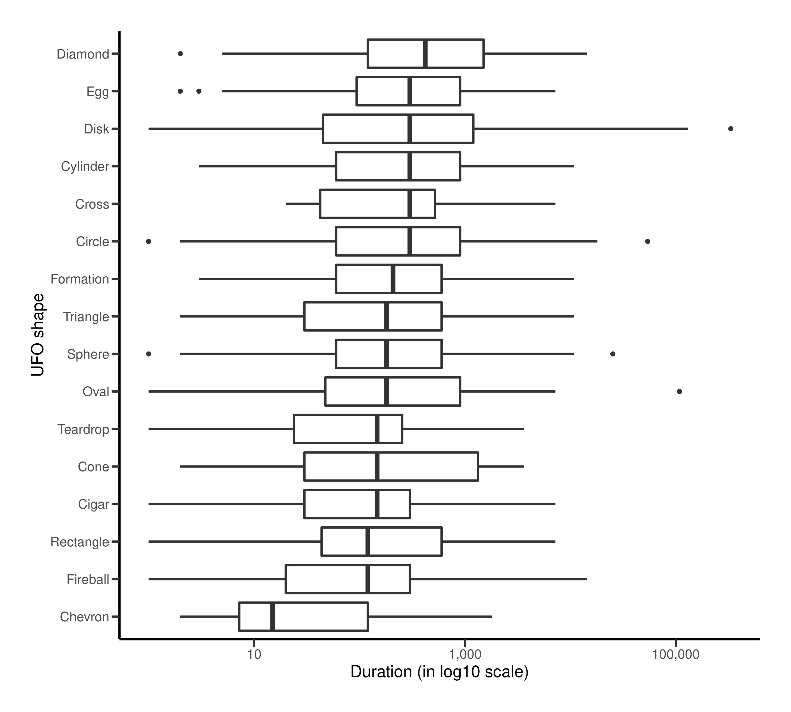
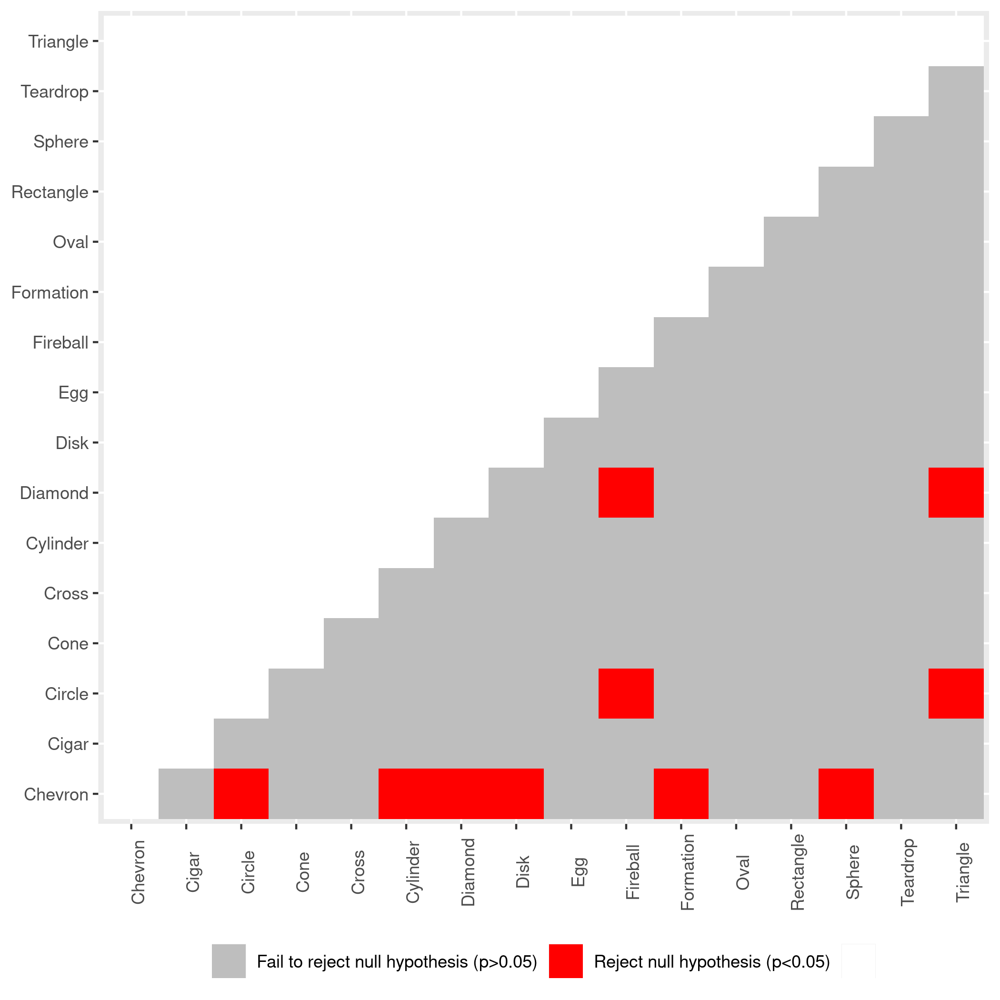
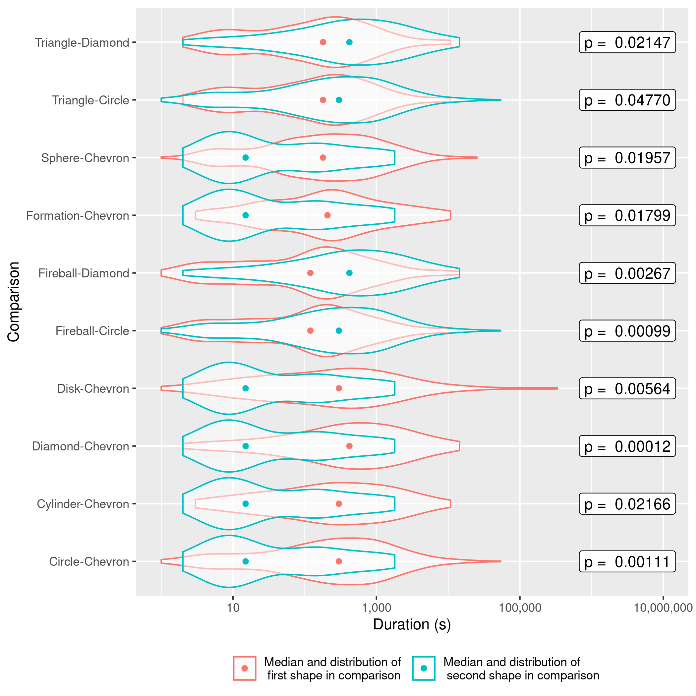

-   [Introduction](#introduction)
-   [Data](#data)
    -   [Data Processing](#data-processing)
        -   [Duration of Observation](#duration-of-observation)
        -   [Shape](#shape)
    -   [Data Visualization](#data-visualization)
-   [Hypotheses](#hypotheses)
-   [Analysis](#analysis)
-   [Results & Discussion](#results-discussion)
-   [Summary](#summary)
-   [References](#references)

Introduction
============

Unidentified flying objects (UFOs) have a long and somewhat contentious
history. Contrary to popular belief, most sightings are actually honest
mistakes and not hoaxes. Weather balloons, satellites, and other
explicable phenomena account for the vast majority of sightings. We
wondered if these different phenomenon might leave traces in the data.
Suspecting that different causes would be associated with different
shapes of UFO reported in the sighting, we thought that these different
causes might lead to different duration of sightings in our home areas
of Washington and British Columbia.

Data
====

To test our hypothesis, we selected the dataset UFO sightings maintained
by (The National UFO Reporting Center 2020). The data is submitted by
users and in the majority of cases presented in the users’ own words.
Each report in the NUFORC database contains information on the data and
time of the sighting, the location, the shape of the object observed,
how long it was observed for, and a short description of the event. For
analysis, we have selected reports made in [British Columbia,
Canada](http://www.nuforc.org/webreports/ndxlBC.html) and [Washington
State, USA](http://www.nuforc.org/webreports/ndxlWA.html) before
11/18/2020. The selected reports include a total 4710 observations. The
present analysis was limited to the shape of the objects observed and
the duration for which they were observed.

Data Processing
---------------

Data was analyzed using both the R (R Core Team 2019) and Python (Van
Rossum and Drake 2009) programming languages. A comprehensive list of
packaged used can be found in the readme file of [this project’s GitHub
repository](https://github.com/UBC-MDS/out_of_this_world).

### Duration of Observation

Each UFO sighting report included from NUFORC includes a text column
where users have the opportunity to described how long they observed the
unknown object. These descriptions do not have a consistent format. For
example, the following demonstrate some of the variety of different
formats in which duration data is presented:

-   “20:45”
-   “3-4 minutes”
-   “Ten minutes”
-   “every evening for the las”
-   “.30”
-   “Ongoing”

Where possible, the reported durations were programmatically converted
to a standardized measure (total duration in seconds). Where this was
not possible, observations were discarded. It is acknowledged that this
introduces a bias in the results toward observations from people who
recorded the duration of their observations in a method that can be
easilty interpreted programmatically.

### Shape

In most cases, users indicate the shape of the object that they observed
in their report. Reports that did not specify any shape or specified
something other than shape, for example `Flash`, `Light`, `Unknown`,
`Other`, `Changing`, were removed.

Data Visualization
------------------

The processed data set used in the analysis consists of 1846
observations. The following box plot illustrates sample data set
included in this analysis. Note that because the data are significantly
right skewed, the duration has been plotted on a logarithmic axis so
that the data can be more easily compared.

Hypotheses
==========

Because of the skewness of the data presented above, a comparison of the
mean duration of observations between the different shapes would not be
an appropriate approach. Instead, our hypotheses are formulated to look
for a difference in the duration distributions between shapes on the
basis of the ranks of duration of observations for the different shapes.
More formally, our null (*H*0) and alternate
(*H**A*) hypotheses are:

-   *H*0 The mean ranks of the duration of sightings for all
    shapes are equal.

-   *H**A* The mean ranks of the duration of sightings for
    all shapes are not equal.

Analysis
========

To test our hypotheses, we took a non-parametric approach because of
differences in group size, skewed distribution, and variance between the
different duration of different shapes. We selected the Kruskal-Wallis H
Test to test to determine if significant differences existed. A Dunn
test was utilized for Post-Hoc analysis with Bonferroni’s correction to
identify pairs of groups whose median population duration are
significantly different. We selected a significance level of *α* = 0.05
for both steps in testing.

Results & Discussion
====================

**Kruskal Wallis H Test**

The Kruskal Wallis H Test resulted in a *p*-value much less than our
stated significance level of 0.05, therefore, we reject the null
hypothesis that the mean ranks of the duration of sightings are equal
for all shapes.

| Model          | p-value      |
|:---------------|:-------------|
| Kruskal-Wallis | 1.220297e-07 |

**Dunn Test**

Knowing that the mean ranks of the duration of sightings are not equal
for all shapes, we are interested in comparing each shape to all the
other shapes. A Dunn test was used to perform pairwise comparisons. The
pairs of distributions which showed a statistically significant
difference are presented in the table below along with their *p*-values
(using the Bonferroni correction).

| Comparison        |  Adjusted p-value|
|:------------------|-----------------:|
| Circle-Chevron    |         0.0009538|
| Cylinder-Chevron  |         0.0187231|
| Diamond-Chevron   |         0.0001069|
| Disk-Chevron      |         0.0048696|
| Formation-Chevron |         0.0156516|
| Sphere-Chevron    |         0.0169818|
| Fireball-Circle   |         0.0008348|
| Triangle-Circle   |         0.0407988|
| Fireball-Diamond  |         0.0022711|
| Triangle-Diamond  |         0.0183957|

To assist in visualizing these results, the following plot graphically
depicts the pairs of distribution that showed a statistically
significant difference (red) and those which did not (grey).

**Post-Hoc Analysis Result**

The figure below further explores the differences between distributions
by overlaying violin plots for each of the distribution pairs along with
the distribution medians. The adjusted pairwise *p*-values are also
presented.

**Pairwise distributions and medians**

Based on the results of these pairwise comparisons, we see that the
distributions of several shapes are significantly different from one
another. We are not, however, able to postulate a cause for the
difference based on these analyses.

There are some important limitations to this work. As discussed in
previous sections we removed a good deal of data in processing. There is
potential that we somehow introduced a bias into our results through
this process. Furthermore, our sample was not random or representative
of all UFO sightings in the BC and Washington area because we only had
access to samples that were reported.

Summary
=======

A UFO sighting data set including UFO shape and duration of sighting was
obtained for British Columbia and Washington State from NUFORC. A
Kruskal Wallis H test was used to determine that there was a significant
difference in the mean ranks of duration among the shapes. Pairwise Dunn
tests revealed that several shapes were significantly different from one
another. Further research would be necessary to determine the underlying
cause(s) of the differences.

References
==========

R Core Team. 2019. *R: A Language and Environment for Statistical
Computing*. Vienna, Austria: R Foundation for Statistical Computing.
<https://www.R-project.org/>.

The National UFO Reporting Center. 2020. “The National UFO Reporting
Center Report Database.” <http://www.nuforc.org/>.

Van Rossum, Guido, and Fred L. Drake. 2009. *Python 3 Reference Manual*.
Scotts Valley, CA: CreateSpace.
